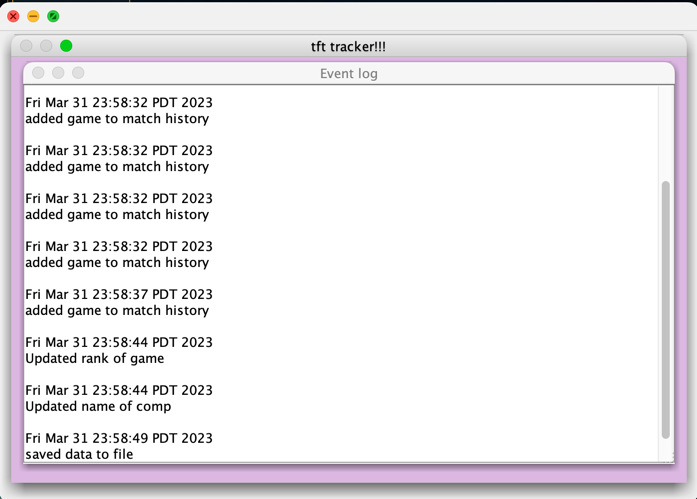
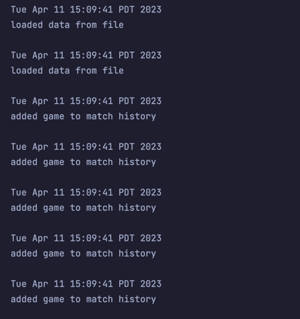

# TFT Game Tracker App

## The Project:

- ***What will the application do?***
    - The application will track TFT games, allowing the user to input their time, date, placement and team comp played for each game. Returning total statistics for all games saved: totals for each placement (1th - 8th), average winrate where all placements above 4th count as a win, and number of times each comp has been played 
    - The application can save and restore the entire state of the application
  
  
- ***Who will use it?***
  - Users who play TFT and who wish to track the progress of their TFT games will use this application. TFT (aka Teamfight Tactics) is an auto battler game that can be played on desktop among other platforms 
  

- ***Why is this project of interest to you?***
  - This project is of interest to me because I enjoy playing TFT in my free time and it would be helpful to have something to keep track of as many games as I want. I could use this project to keep track of games played during a single session or even track my long term progress. 

## User Stories: ## 

- As a user, I want to be able to create a game and add it to my list of games played
- As a user, I want to be able to view a list of games played - display name of comp and rank
- As a user, I want to be able to edit the games in my match history
- As a user, I want to be able to view stats on games played. Stats include the number of times I have placed in each rank, total winrate, and the number of times a comp has been used. 
- REMOVED: As a user, I want to be able to remove a game from my match history. 

- As a user, I want to have the option to save my match history to file. 
- As a user, when I start the app, I want to be given the option to load my match history from file. 
  - UPDATE TO ABOVE USER STORY: As a user, I want to be able to load and save the state of the application

# Instructions for Grader
- match history might be easier to see in full view 

- You can generate the first required action related to adding Xs to a Y by clicking on 'add' and inputting data, click 'return to main menu' and click 'open' to see the updated history. 
  - if inputted rank is out of range, pop-up appears and game isn't added
- You can generate the second required action related to adding Xs to a Y by clicking on 'edit' and inputting data, click 'return to main menu' and click 'open' to see the updated history.
  - if inputted rank is out of range, pop-up appears and game isn't edited
- You can locate my visual component by opening the app - it is the background of the main panel
- You can save the state of my application by clicking 'save' in the main menu
- You can reload the state of my application by clicking 'load' in the main menu

# Phase 4: Task 2
The first screenshot is from the event log printed in my GUI and the second one is the log printed to the console.

# Phase 4: Task 3 
I would refactor my GUI class into multiple smaller classes to increase cohesion according to the single responsibility principle because putting everything related to GUI in one class made it quite cluttered and unclear. For example, I could probably separate different panels into separate classes. I could also refactor my GUI class and use more abstract classes/interfaces because there's a lot of repetitive 
code between my GUI methods. One example of this is the methods I use for editing and adding games, there's a lot of similarity between the methods I used.  There's also quite a few long methods in my GUI class, so I could make more helper methods to improve cohesion. 
## Projects Referenced ##
- https://github.students.cs.ubc.ca/CPSC210/AlarmSystem/
- https://github.students.cs.ubc.ca/CPSC210/B02-SpaceInvadersBase 
- https://github.students.cs.ubc.ca/CPSC210/C3-LectureLabSolution/blob/776c8678071abed56af8e793b57ab2b39046a9eb/src/main/gui/IntersectionGUI.java
- https://github.students.cs.ubc.ca/CPSC210/SimpleDrawingPlayer-Starter/blob/1f78f052e49d4497d3550df2e40ca91991e46327/src/ui/DrawingEditor.java
